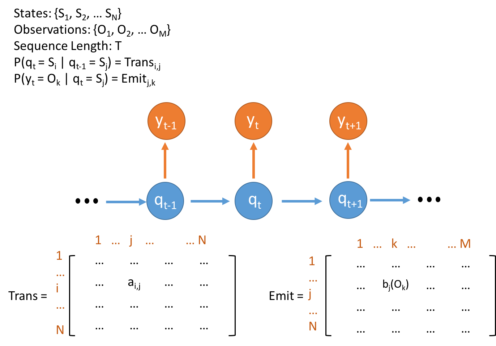
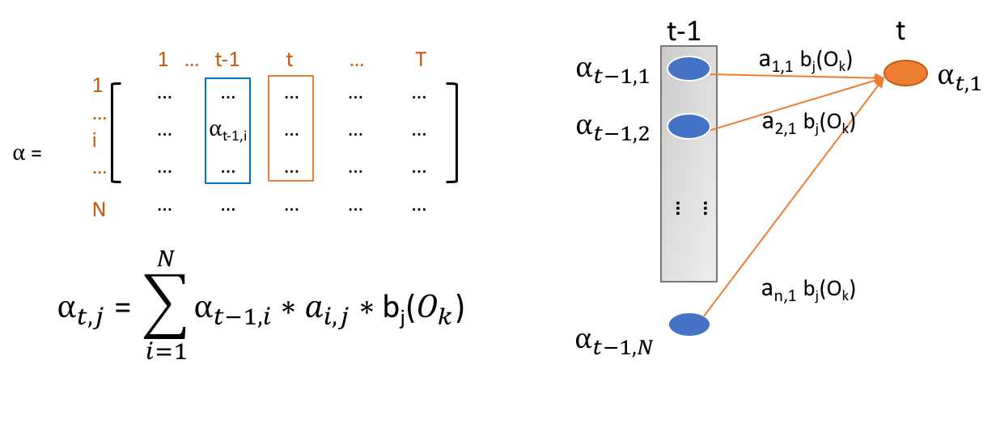
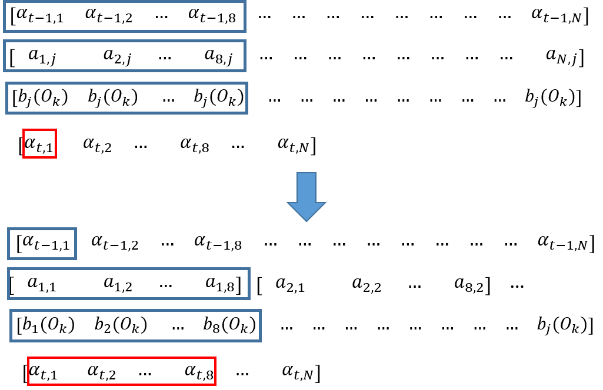
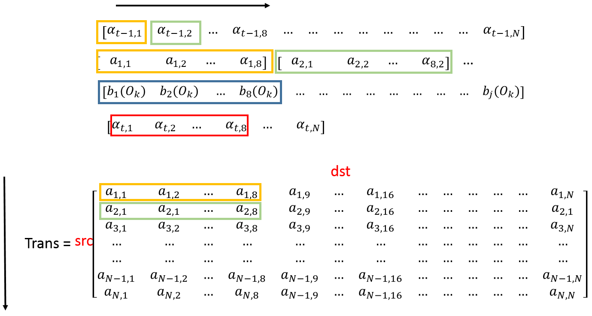
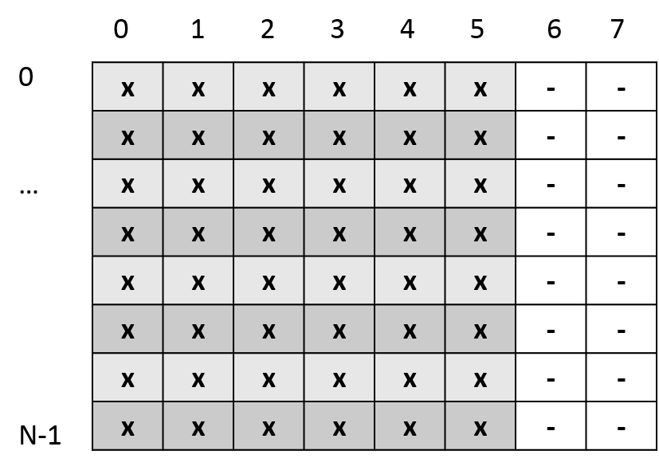
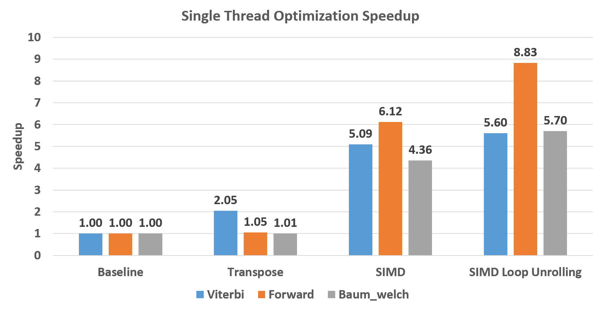
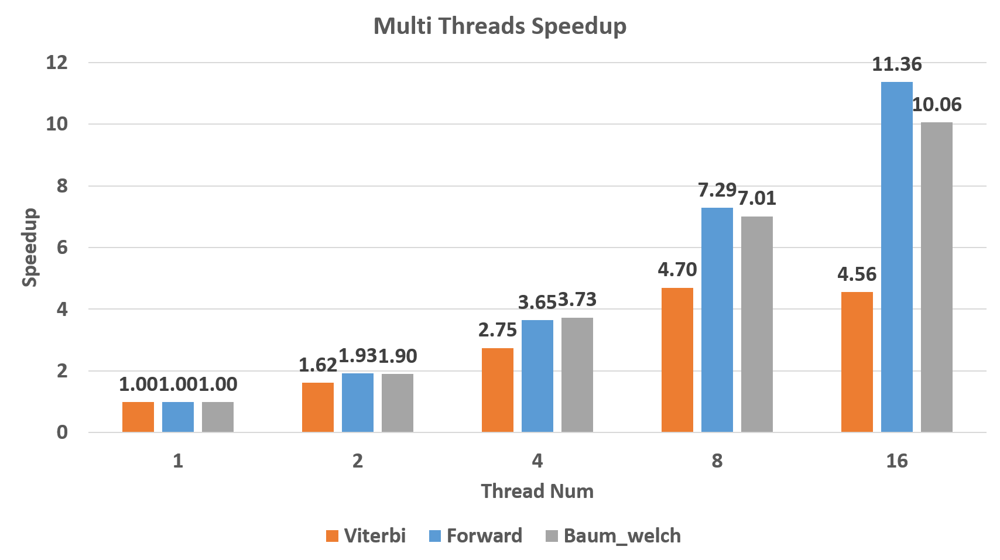
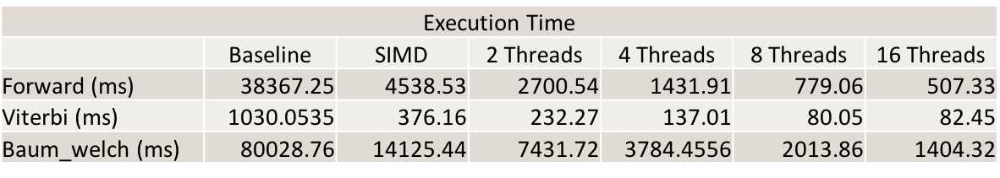
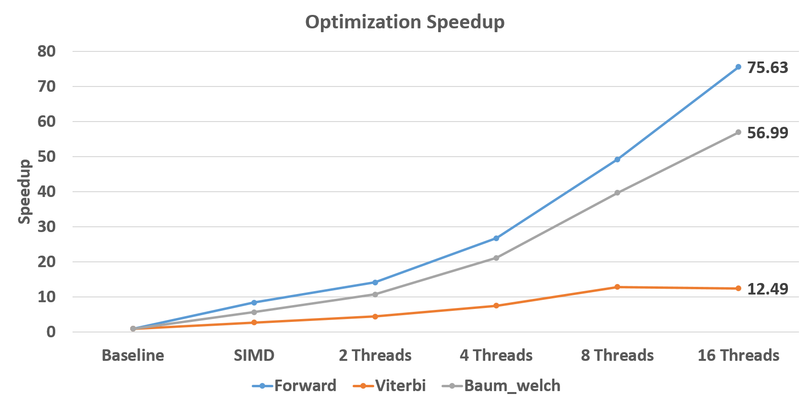
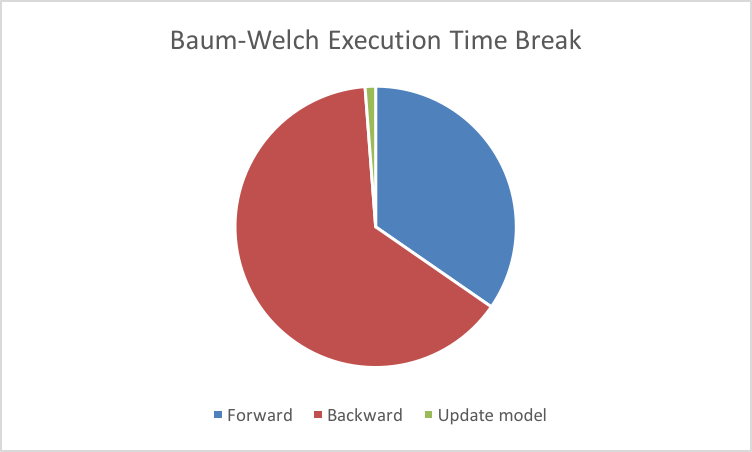

# Parallel Hidden Markov Model

Team members:
- Yuchen Huo (<yhuo1@andrew.cmu.edu>)
- Danhao Guo (<danhaog@andrew.cmu.edu>)

# Final Report
## Overview
We implemented the multi-core parallel version of Hidden Markov Model (HMM) algorithms:
1. Compute the probability of the observation sequence. (Forward / Backward Algorithm) 
2. Decode the observations to find hidden state sequence with the most probablility. (Viterbi Algorithm) 
3. Unsupervised training of Hidden Markov Mode parameters. (Baum-Welch Algorithm)

We tested our implementation on the 8 physical cores hyper-threading GHC machines. With AVX instructions, we achieved **8.83X**, **5.60X** and **5.70X** speed up over baseline for single thread Forward, Viterbi and Baum-Welch algorithm . With 8 threads, we achieved **7.29X**, **4.56X** and **7.01X** speed up over the AVX implementation. **We achieved a total speed up of 75.63X and 56.99X over the best singled threaded baseline for Forward algorithm and Baum-Welch Training Algorithm using 16 threads on the GHC machine with AVX instructions.**

## Technical Challenges
Our optimization focuses on two levels of parallelism: 1. SIMD parallelism 2. Multi-threading parallelism. Hidden Markov Model algorithms are similar to the inference procedure of the deep neural network, which is performed by a layer by layer fashion. Each layer depends on the previous layer, but in each layer, the computation is independent. Therefore, work can be easily divided for each thread and the speed up is close to linear. However, it is non-trivial to utilize SIMD parallelism in HMM algorithms. The challenge comes from several parts:
1. Since all transition and emission probability numbers are small, to avoid arithmetic instability, all the computation has to be performed in log-space. This makes it different from simple matrix multiplication which has been studied well.
2. Matrices layouts have to be carefully chosen to avoid scatter and gather in the SIMD instructions.
3. Three algorithms have different data access patterns, algorithms need to consider data locality.

## Background
Hidden Markov model contains a Markov chain of hidden states and their emisstion to observations. The network example is shown in Figure 1. Notice that Markov property assumes that a state is only dependent on its direct predecessor state. And this is the premises of Hidden Markov Model.

*Figure 1. Concepts and Data Structure for Hidden Markov Model*

The main data structures for Hidden Markov Models are two matrixs storing the transition probability between hidden states and emission probability from hidden states to observations. The main operations on these two matrixs are from the calculation of alpha in forward algorithm, lambda in Viterbi alogrithm and beta in Backward algorithm (part of Baum-Welch algorithm). All computations of these three variables are similar. So We takes alpha as an example.

*Figure 2. Dynamic Programming of Alpha Table Computation*

Each alpha's value is dependent on the all alpha values of last time slot. So, the calculation includes vector multiplication of alpha in last layer, transit probability and observation probability. And then, multiplication results in the vector are summed to be the final result alpha. What should be noticed is the probabilities in real model is pretty small if the model keeps a large amount of hidden states. So, All calculations are supposed to be conducted in log space. In this regard, all multiplications becomes addition. And in calculation of alpha and beta, the aggregation function at the last becomes logsum. The logsum functions is shown below:
```
logsum(x, y) = max(x, y) + log(1+exp(|y - x|))
```
This is where the main computation happens. Note that, the aggregation of lambdas in Viterbi algorithm is maximum instead of summation. So, the maximum operations do not change in log space because of the monotonicity of log operations. Since the computation of all alpha in the same layer. It can be potantially fully parallelized.

## Approach
We tried to parallelize all three algorithms on multi-core CPU platforms with SIMD support. We start from a sequential [implementation](https://github.com/chuan/chmm) of the HMM algorithms which also contains a cuda implementation. As previously discussed, the data dependency is between each column in the dynamic programming table \alpha, but the computation of each value in the same column is independent. So the multithreading parallel part is quite simple as the following pseudo code.
```
for i in 0 .. T-1:
	#pragma openmp parallel for
	For j in 1 ... N:
		For k in 1 ... N:
			p = alpha[(i-1)][k] + trans[k][j] + obvs[j][i]
			alpha[i][j] = logadd(alpha[i][j], p);
```

Notice that we are traversing the alpha table row by row, while the accesses of transition matrix are column by column. This is not a cache friendly accessing pattern. A easy fix for this is to transpose the matrix so that the values are also read from the transition matrix row by row. Since there is no data dependency in each column, the multithreading implementation is able to get quite linear speedup in large datasets with lots of hidden states as the computation intensity of logadd for each value is very high. This could be seen from Figure 7 where only Viterbi algorithm benefits from matrix transpose. The other two algorithms are actually computation bounded.
### SIMD with AVX intrinsics
To further utilize SIMD instructions to speed up the computation, we need to vectorize the computation of the inner loop. AVX instructions could compute 8 floating point numbers with a single instruction which should be able to accelerate our algorithm a lot. Let’s check the actual computation first. The following graph is a visualized abstraction of the computation in the Forward algorithm.

*Figure 3. Visualization of Forward Algorithm Alpha Computation*

As you can see, each thread would need to compute the sum of all multiplication results for a single value in column alpha[t]. It is simple to use AVX instructions for the multiplication part. However, in the end we need to compute the sum of the values in the 256bits register, which is not very efficient since we need to perform a horizontal reduction by shifting and addition (six operations to get the sum of eight values). What is even worse is that in the log space, we cannot get the sum by simple addition. Instead, we have to perform an expensive logsum as we have discussed in the background section. The horizontal logsum becomes even more inefficient and this becomes a bottleneck for the SIMD utilization. The reason is that most of the computation time for Forward algorithm is taken in the logsum operation and therefore parallelizing the multiplication part does not contribute too much.
Since the key issue here is that we need to perform a horizontal summation with AVX instruction, we could change the problem to a vertical summation which accumulates the sum for each different alpha value we need to compute. The following figure shows the difference between these two approaches.

*Figure 4. SIMD Parallelism in Vertical and Horizonal*

In the sequential algorithm, we have to perform the sum reduction since we are computing a single alpha value which is shown in the upper part. Our SIMD implementation avoids the reduction by putting the eight results in the SIMD vector and accumulating the multiplication results to the result vector. Here, we use an [AVX_Math]( http://software-lisc.fbk.eu/avx_mathfun/) library which could computes the logarithm and exponentials for AVX vectors. Based on that, we are able to implement the AVX_logsum which could add eight multiplication results to the accumulator and fully utilize the SIMD units.
```
inline __m256 logadd(__m256 a, __m256 b) {
    __m256 max_AVX, min_AVX; 
    __m256 all_one = _mm256_set1_ps(1);
    max_AVX = _mm256_max_ps(a, b);
    min_AVX = _mm256_min_ps(a, b);
    min_AVX = _mm256_sub_ps(min_AVX, max_AVX);
    min_AVX = exp256_ps(min_AVX);
    min_AVX = _mm256_add_ps(min_AVX, all_one);
    min_AVX = log256_ps(min_AVX);
    return _mm256_add_ps(max_AVX,  min_AVX);
}
```
### Loop Unrolling to get better locality
After we change the algorithm, the memory access pattern actually changes. The following figure gives a taste of the access pattern of the transition matrix.

*Figure 5. SIMD + Unrolling Data Access Pattern*

In each inner loop, we would read out 8 float values from transition matrix and perform SIMD operations on them. This access pattern is not ideal, since we are still read values vertically. However, it does not impair the performance too much since the computation intensity is pretty high as we are using the AVX SIMD instructions.

Since the cache line size is 512 bits long, while AVX register is only 256 bits long, the rest 8 float values would be evicted out of the higher level cache due to our vertical access pattern. We could solve this problem by loop unrolling and accumulating 2 SIMD vectors. In this case, we are able to use all the values we read into the Level 1 cache line which doubles the computation intensity.

One interesting thing here is that for the sequential algorithm, we use the transpose matrix to improve locality while we have to use the original matrix to improve the SIMD utilization. The key take away is that for parallel programing, the best data layout may differ from each algorithm.
### Different model size support
Since we are using the AVX SIMD instructions to accelerate the algorithm, one key requirement is that all matrices have to be 32 bytes aligned. Our experiments are mainly performed on hidden states like 256, 512, 1024 etc. where the data alignment and partitioning is not a problem. However, in order to make our implementation suitable for different sizes of models, we use padding to make all operations could still be performed by AVX operations.

{:height="500px" width="500px"}

*Figure 6. layout of Padding for Flexible Model Size*

The example shows the situation where only 6 floating values in each row. We add two zeros to make the alignment correct for AVX instructions. Special boundary conditions are handled in the code. In order to support the loop unroll, we set the padding size to be 16 float length. In our experiments, the overhead of this is negligible since it does not modify the inner loop structure.


## Results
We conducts series of experiments on our ParaHMM implementation to evaluate the performance optimization we achieve.
The device we use is GHC machine with 8 core (2 hyper-threads) 3.2 GHz Intel Core i7 processors. It supports AVX2 (256bits) vector instructions with OpenMP library. The program compiles with GCC -O2 configuration.
All experiments are conducted on the Hidden Markov Model with 1024 hidden states and 32 observations. The observation sequence length is 1000. The baseline we compared with is the Single threaded implementation from cuHMM.

The Single thread optimization figure shows the performance speedup of our implementations compared with baseline. Figure 7 shows that SIMD implementations brings out more than 4 times speedup compared with transpose version, which is reasonable for SIMD implementation although the theoretical maximum speedup is 8x. Note that the performance gain of Viterbi is quite different from the other two algorithms. The reason is that it use max function rather than logsum function to do aggregation. Its computation intensity is much lower. So, it benefits more from transpose instead of SIMD support compared with other two algorithms. Moreover, the speedup gain on loop unrolling proves that the locality of data access pattern improves a lot.

*Figure 7. Single Thread Optimization for All Three Algorithms*

Figure 8 shows great scalability of our algorithm. Our algorithm scales almost linearly on Forward and Baum-Welch algorithm with sub-linear scalability. The reason why Viterbi only scales sub-linearly is that its computation overhead is relative low so that the overhead of spawning threads is non-negligible. Note that non-linear speedup between 8 threads and 16 threads results from hyper-threading rather than physical multi-cores.

*Figure 8. Multithreading Speedup*

Finally, we experiments our totally execution time. The Baseline here is the single-thread transpose version. The result in Table 1 shows we reduce Forward algorithm running time from 38 seconds to 0.5 seconds. Viterbi algorithm also improves from 1030 milliseconds to 82 milliseconds. Baum-Welch alogrithms finishes in 2 seconds instead of more than 80 seconds in baseline. According to Figure 9, The best speedup is achieved on Forward algorithm, which is 75.63X.

*Table 1. Overall Execution Time for Each Algorithm*

*Figure 9. Overall Speedup for Each Algorithm*

The main execution of Forward and Viterbi algorithm is focused on computation of alpha and lambda table. They cost almost all time consumed in the algorithm. For Baum-Welch algorithm, the workload can be divided into three parts as Figure 10. Backward algorithm includes computation of beta, Xi and GMM which also uses dynamic programming. Xi and GMM are used to compute updates on two matrices. Maybe more improvement on locality of Xi and GMM computation can be considered.



*Figure 10. Execution Time Division of Baum-Welch Algorithm*

Since the HMM model has data dependency between each layer, therefore the parallelism is limited by the model size. We think GPU would not be a suitable platform for normal model size (hidden state size and observation size) where the hardware cannot be fully utilized. However, it is possible to use GPUs for throughput sensitive scenarios, where lots of requests can be computed at the same time. For latency sensitive tasks we believes that the multithreading SIMD implementation would be enough as we could achieve pretty high performance.

# Reference
[1] Rabiner, Lawrence, and B. Juang.
"An introduction to Hidden Markov Models." ieee assp magazine 3.1 (1986): 4-16.

# Work Division
Equal work was performed by both project members.

# Middle Checkpoint
Our original project idea was to extend the Kernalized Correlation Filter (KCF) [2, 3], a fast object tracker, to the multicore platform. We downloaded the original paper’s code and built up the test framework using the [Need for Speed benchmark](http://ci2cv.net/nfs/index.html)  and [VOT2014 benchmark]( http://www.votchallenge.net/vot2014/dataset.html). We then performed some profiling on the sequential implementation. The result shows that most of the cpu time is spent in the discrete fourier transform and the HOG feature extraction which is consistent to our intuition. However, as in the object tracking tasks, the bounding box of the target object is not very large and after using HOG feature which compresses 4x4 cells into single feature descriptor, the dft computation is conducted on a quite small matrix. According to our measurement, the processing time for a single frame is about 8ms where dft time holds for 4-5ms. Since in object tracking task each frame’s computation depends on the result of the previous one, the dependency is pretty high. Therefore, we think this system is not very suitable for multithreading, since the overhead of spawning and synchronization would be larger than the actual computation. We actually try to use the FFTW library to replace the opencv implementation for the code, the performance becomes worse. Therefore, the only parallelism we could benefit from would be using SIMD instructions. We think this project actually could not get much performance improvement from the multicore platform and seems to be quite narrow in opptimization approaches. We decided to switch the project. 

# New proposal
## Summary
We are going to implement the parallel version of Hidden Markov Model (HMM) [1] training and classification algorithm utilizing SIMD and multithreading. HMM involves three basic problems: 
1. Compute the probability of the observation sequence. (Forward / Backward Algorithm) 
2. Decode the observations to find hidden state sequence with the most probablility. (Viterbi Algorithm) 
3. Unsupervised training of hidden Markov mode parameters. (Baum-Welch Algorithm)

## Background:
Markov model describes systems with randomly changes in which the future states of the system only depend on the current state instead of the events before the current state. HMM assumes the observations are assumed to be the result (emission) of unobserved hidden states in a Markov model. HHM are especially used in the applications of pattern recognition such as text tagging, semantics analytics and speech recognition. 

## Challenges:
1. Identify performance bottleneck and analyze the feasibility of parallelism on the part is not that easy.
2. For HMM with large state space, the space needed for parameters are too large to be loaded into L1 cache at the same time. Implementing parallel HMM with friendly data locality is also a big factor of performance improvement.

## Resources:
A sequential [implementation](https://github.com/chuan/chmm) of the HMM algorithms which also contains a cuda implementation.

## Our goals:
80% Goal:
Implementing a multi-threaded HMM with SIMD intrinsics especially for large state space which needs friendly data locality. (including Baum–Welch algorithm, Forward algorithm, Backward algorithm and Viterbi algorithm)

100% Goal:
Exploring bottleneck of HMM for relative small state space. Generalizing HMM algorithm optimization with different strategies for different state space configuration. 

## Platform choice:
We would develop and test our software on the GHC machines which have 8 cores and AVX2 support.

# Checkpoint Report:
We spent quite a lot time in setting up the experiment environment for the original project idea, profiling and a few more days to seek a new project idea, so we are kind of left behind. By now, we have selected a sequential HMM implementation as our code base and built up the test cases for benchmarking. We have identified the data dependency in all of the three algorithms and we believe that they may benefit from optimized multithread vector-matrix multiplication with the help of AVX operations.

Since it is a bit late in the whole schedule, we would try our best to catch up. We decide to implement the SIMD optimized version of all three algorithms by the end of this week. We shall spend one more week to implement multi-threaded version concerning data locality using OpenMP. Both of us have no more exams after 5/8, therefore we would work hard and spend all of our time to explore the remaining possible optimization in the project and try to make it able to accelerate problems with different working set as different model size might need different parallel degree.

## We plan to show several graphs on the competition
* The AVX instruction speedup of all three algorithms.
* The speed up of multicore HMM algorithms using different number of cores.
* The speed up of our implementation on different working set size. 

## Issues we concerned:
* It should be possible to accelerate long Markov chains with lots of hidden states and observation types though multithreading. However, we do search on the internet and find out there are not too many application that would make use of this kind of Hidden Markov model. We are not sure if this would be a big problem. This project would make use of many of the idea we learnt in the course but it might not be that useful for real workload. We do plan to measure the performance on different size of the working set, we may be able to implement a more agile algorithm suitable for different size of models.

## Modified time table for coming up tasks:
* Apr. 27th – Apr. 30th: Implementing SIMD version of Forward/Backward algorithm and Baum-Welch by Yuchen, SIMD version of Vertibi algorithm by Danhao.
* May. 1th – May. 3th: Taking exams. Try some matrix multiplication lib for Baum-Welch algorithm if possible.
* May. 4th – May.7th: Use OpenMP to parallel the algorithms and explore data locality in the algorithm by both Yuchen and Danhao.
* May. 9th – May. 11th: Explore other possible optimizations and try to make the implementation flexible for different size of working set. Documenting and prepare for presentation.


## Reference
[1] Rabiner, Lawrence, and B. Juang.
"An introduction to Hidden Markov Models." ieee assp magazine 3.1 (1986): 4-16.

# Original Proposal
## C++ Parallel KCF Tracker

## Summary
We are going to extend the Kernalized Correlation Filter (KCF) [2, 3], a fast object tracker, to the multicore platform.

## Background
Visual Object Tracking is one of the popular tasks in the computer vision area. There are a lot of different implementations focusing on how to improve the accuracy of the tracking algorithm. These implementations mostly target at the "real time" online systems, which have been aimed at approximate frame rate of 30 Frames Per Second(FPS), enough for previous devices and workloads. However, for higher frame rate cameras (240 FPS) or an offline video processing pipeline, 30 FPS still seems to be slow. We look through some of the benchmark results [4, 5] and find this Kernalized Correlation Filter which provide top speed on CPU and pretty good accuracy. We decide to further extend this algorithm to be able to benefit from multicore systems and be fast enough to be used offline.

By creating the circulant training data matrix, KCF uses Discrete Fourier Transform (DFT) to compute the close form solution of Ridge Regression and reduce both the storage and computation. It further uses HOG feature instead of raw pixels to gain better mean precision on the testing dataset. The remaining main computation lies in the dft and HOG feature extraction. There are plenty of fast parallel algorithms for dft and HOG feature extraction so we decide to build the parallel oject tracker based on the KCF implementation. 

Fast Fourier Transforms (FFT) is an efficient way for calculation of DFT by utilizing DFT's symmetry properties. Compared with O(N^2) computation complexity, the computational cost of FFT is only O(N log(N)) It is a key tool in most of digital signal processing systems including object tracking ones. In the KCF object tracking algorithm, FFT is heavily used for learning and evaluation to achieve lower computational complexity. For example, by utilizing FFT operation, KRLS learning algorithm is improved from O(N^4) to only O(N^2 log(N)) for NxN 2D images.

## Challenge
The biggest challenge is that we are not very familiar with the computer vision algorithm so it may take time for us to understand the implementation details of the KCF tracker. However, since we have the open source implementation, we may not need to understand every single lines in the code. Instead, we may identify the paralizable parts and do optimization on these parts.

Although FFT brings out great improvement on performance, it is still computational intensive with O(n log(n)) complexity. According to the properties of FFT algorithm itself, we believe that there should be some computational independent tasks inside it such as the DFT calculation of even terms and odd terms in each iteration. So, it may benefit from parallel implementation on multi-threaded processing. To implement FFT in parallel, the major points is that multi-dimensional FFT is utilized. In this regard, analyzing computation independence becomes tough. Meanwhile, applying such complicated algorithm with parallel technologies especially AVX instructions are pretty hard. We plan to combine both AVX and OpenMP to support different level of parallelism for FFT.

For HOG feature extraction, there have already been a few multicore CPU and GPU implementations for different computer vision tasks. We would be able to borrow some the ideas from them but their optimizations are often combined with the specific vision task algorithm, so we may need to develop our own version and some further optimization might be adopted to offer better performance for the KCF tracker.

KCF has done a lot of optimization to reduce the computation which makes it the fastest cpu object tracker implementation, we are not sure that the remaining computation would still be enough to gain benefits from multithreading. This might be a problem. We would try to identify this as soon as possible.

## Resources
The Author of KCF open source their [code](https://github.com/joaofaro/KCFcpp) on the github so we are able to build our parallel version based on their implementation. OpenCV is an open source library for computer vision. It provides tons of functions for real-time computer vision. The [code](https://github.com/opencv/opencv) is available on GitHub. we could build our parallel FFT implementation based on the top of OpenCV's source code. We would develop and test our software on the GHC machines which have 8 cores and we may further test the performance on Xeon Phi machines or develop the GPU version to see how our implementation scales if everything goes smoothly.

## Evaluation and Goals
Since KCF tracker currently is a sequential implementation, we hope our parallel version could achieve close to linear speedup comparing to the sequential version. The basic performance measure would just be the speedup/ core number graph. However, as we haven't identified the dependency in the current implementation, we are not very sure if this is possible to achieve the linear speedup.

We may try to use other libraries like FFTW to compare the performance to see if we have achieved a good enough parallel implementation. Opencv also have implemented the same object tracker, which we may use to perform the comparison.

Minimum Goal: 1. ReImplement FFT algorithm to support multicore and SIMD parallelism. The parallel FFT should be faster than the original FFT implementation in KCF and improve the overall performance of KCF algorithm on multicore machines. 2. Implement multithread and SIMD version of the HOG feature computation, along with parallel FFT, to improve the performance of KCF algorithm.

Expected Goal: 1. The parallel FFT could achieve sub-linear scalability with the increase of core number in the machine. 2. Perform enough experiment to make parallel HOG feature processing fast enough to reach some other implementation's speedup.

Stretch Goal: The parallel FFT could beat other excellent DFT calculation libraries, such as FFTW, in performance.

## Reference
[2] J. F. Henriques, R. Caseiro, P. Martins, J. Batista,   
"High-Speed Tracking with Kernelized Correlation Filters", TPAMI 2015.

[3] J. F. Henriques, R. Caseiro, P. Martins, J. Batista,   
"Exploiting the Circulant Structure of Tracking-by-detection with Kernels", ECCV 2012.

[4] H. Kiani Galoogahi, A. Fagg, C. Huang, D. Ramanan, S.Lucey,   
"Need for Speed: A Benchmark for Higher Frame Rate Object Tracking", 2017, arXiv preprint arXiv:1703.05884.

[5] Y. Wu and J. Lim and M. Yan,   
"Online Object Tracking: A Benchmark", CVPR 2013

## Schedule
Week 1 (Apr. 3rd): 

Deciding project idea; 
Investigation background (Papers and Code); 
Writing proposal. 

Week 2 (Apr. 10th): 

Implementing parallel FFT with OpenMP;
Implementing parallel HOG features extraction with OpenMP.

Week 3 (Apr. 17th): 

Incremental developing parallel FFT with AVX;
Incremental developing parallel HOG features extraction with AVX.
Integrating two implementations into KCF algorithm;

Week 4 (Apr. 24th):

Conducting experiments to evaluate ParaKCF on both performance improvement and scalability;
Tuning the implementation to improve the performance.

Week 5 (May 1st): 

Cleaning code;
Perfecting documentation;
Writing final report;
Preparing for the final competition.
